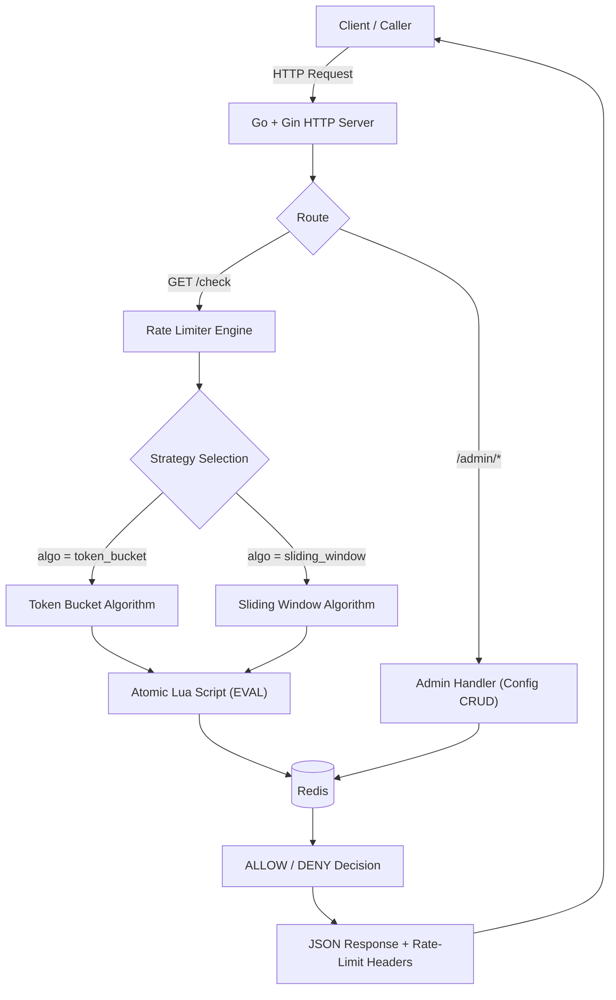

# Distributed Rate Limiter Service

**A Redis-backed distributed rate limiter, written in Go, enforcing per-client request limits across concurrent traffic using atomic Lua scripting — supporting both Token Bucket and Sliding Window algorithms.**

`Go` · `Gin` · `Redis` · `Lua` · `Docker` · `k6` · `Render`

Live demo: **https://distributed-rate-limiter-evho.onrender.com** (see [Live Deployment](#11-live-deployment) — the base URL alone returns `404`, specific endpoints are documented below)

---

## 1. Project Overview

A rate limiter decides, for every incoming request, whether a given client is allowed to proceed or must be rejected, based on how many requests that client has already made in a given time frame. It's the mechanism that stands between a public API and abuse, accidental overload, or a single noisy client starving everyone else.

This project is a standalone **rate-limiting microservice**: a Go + Gin HTTP service that sits in front of a protected resource and answers a single question — `ALLOW` or `DENY` — for a given `client_id`, backed by Redis as the shared source of truth for state.

It implements two industry-standard rate-limiting strategies, **Token Bucket** and **Sliding Window**, selectable per client through an Admin API, and guarantees correctness under concurrent access using atomic Redis Lua scripting rather than application-level locking.

The service was built, tested, and deployed following a full engineering lifecycle: implementation → correctness validation → load testing → cloud deployment → production verification.

---

## 2. Motivation

Most beginner-to-intermediate backend projects are CRUD applications — wiring a database to a form. This project was deliberately built to be something different: a system that has to reason about **shared state under concurrency**, not just persist and retrieve records.

The core engineering problem this project solves is a **race condition**: if two requests from the same client arrive at (almost) the same instant, a naive "read the token count, decide, write the token count back" implementation can let both requests through even when only one token remained — a classic check-then-act bug, sometimes called "double-spending" a token. Solving this correctly, and being able to prove it was solved correctly under real concurrent load, is the entire point of the project.

In building it, the project deliberately touches:

- **Shared state** — Redis as the single source of truth across all requests and (potentially) multiple app instances
- **Concurrency** — many simultaneous requests contending for the same per-client state
- **Atomic operations** — Redis Lua scripting as the mechanism that makes the read-decide-write sequence indivisible
- **System design** — a decoupled HTTP layer, rate-limiter engine, and storage layer, connected through clean interfaces
- **Infrastructure concepts** — containerization, environment-driven configuration, and cloud deployment

The goal was not simply to "implement a rate limiter," but to understand how production systems prevent abuse, manage shared resources, and stay correct under load.

---

## 3. Features

- **Token Bucket algorithm** — burst-tolerant rate limiting with continuous refill
- **Sliding Window algorithm** — strict, boundary-safe rate limiting using exact request timestamps
- **Redis-backed state** — bucket state, sliding-window state, and per-client configuration all persisted in Redis, surviving service restarts
- **Atomic Lua scripting** — the entire read-decide-write sequence for each algorithm executes as a single atomic Redis operation, eliminating race conditions
- **Strategy Pattern architecture** — Token Bucket and Sliding Window are interchangeable implementations of a common `RateLimiter` interface; the HTTP layer never branches on algorithm type
- **Admin API** — REST endpoints to create, list, update, and delete per-client rate-limit configuration (rate, burst, algorithm)
- **Request validation** — malformed input (missing client ID, negative rate/burst, unsupported algorithm) is rejected early with clear `400` responses
- **Fail-Closed error handling** — if Redis is unreachable, the service denies requests rather than silently allowing unlimited traffic
- **Structured logging** — startup state and significant errors are logged; the request hot path stays free of noisy per-request logging
- **Dockerized** — full stack (Go service + Redis) runs via a single `docker-compose up`
- **Load-tested with k6** — throughput, latency, and correctness independently verified under concurrent load (see [Performance](#16-performance))
- **Deployed to production** — live on Render with a managed Redis-compatible instance (Valkey), reachable over HTTPS

---

## 4. Technology Stack

| Technology | Purpose | Why Chosen | Role in This Project |
|---|---|---|---|
| **Go** | Application language | Minimal boilerplate, an excellent built-in concurrency model, and the de facto language for infrastructure/backend tooling — the class of software this project belongs to | Implements the HTTP layer, the rate-limiter engine, and the Redis integration |
| **Gin** | HTTP web framework | Lightweight, fast to set up, and widely adopted in the Go ecosystem, without hiding request handling behind heavy abstraction | Handles routing, request binding, and JSON responses for `/check` and `/admin/*` |
| **Redis** | Shared state store | Extremely fast, supports atomic Lua scripting natively, and provides the exact primitives (Hashes, Sorted Sets, `EVAL`) this project's algorithms need | Stores token bucket state, sliding-window timestamps, and per-client configuration — the single source of truth |
| **Lua (Redis `EVAL`)** | Atomic scripting | Redis executes a Lua script as one indivisible operation — the only mechanism used in this project to prevent concurrent requests from double-spending the same rate-limit budget | Implements the read-decide-write logic for both Token Bucket and Sliding Window as single atomic scripts |
| **Docker / Docker Compose** | Containerization | Guarantees a consistent environment between development and deployment, and is the industry-standard packaging format for this class of service | Packages the Go service and Redis together for local development and as the deployable unit in production |
| **k6** | Load testing | A modern, scriptable load-testing tool with built-in metrics/thresholds and a JavaScript scripting model, well suited to defining repeatable, version-controlled test scenarios | Drives the throughput, saturation, and correctness-under-load validation described in [Performance](#16-performance) and [Validation](#15-validation) |
| **Render (+ managed Redis/Valkey)** | Cloud hosting | A managed platform that supports Docker-based deployment and a managed Redis-compatible instance with private internal networking, without the operational overhead of self-managed infrastructure | Hosts the live, publicly reachable deployment of this service |

---

## 5. System Architecture



The Rate Limiter Engine has no HTTP awareness — it depends only on a `RateLimiter` interface, and Token Bucket and Sliding Window are two interchangeable implementations of that interface (Strategy Pattern). Redis is the single source of truth for bucket state, sliding-window state, and per-client configuration; all reads and writes to that state that matter for correctness happen inside a single atomic Lua script.

---

## 6. Request Flow

Lifecycle of a `GET /check?client_id=X` request:

```
1. Gin receives the request and extracts client_id
2. The engine loads that client's configuration from Redis
     - if no configuration exists, a default configuration is used
3. The engine selects a strategy (Token Bucket or Sliding Window) based on the client's configured algorithm
4. The selected strategy executes a single atomic Lua script in Redis:
     - Token Bucket: fetch current tokens + last refill timestamp,
       compute new tokens = old tokens + (elapsed time × refill rate),
       cap at burst capacity, then allow (and decrement) or deny
     - Sliding Window: remove expired timestamps, count remaining
       requests in the window, then allow (and record) or deny
       if the count is within the limit
5. Redis returns the ALLOW/DENY decision from the atomic script
6. The handler sets rate-limit response headers
7. The client receives 200 (ALLOW) or 429 (DENY) with a JSON decision
```

Because the entire read-decide-write sequence in step 4 runs as one atomic Redis operation, no other request can interleave in the middle of it — this is what prevents two concurrent requests from both being allowed against the same, now-exhausted, budget.

---

## 7. Repository Structure

```text
distributed-rate-limiter/
│
├── docs/
│   └── loadtest/
│       ├── lib/                        # Shared k6 helper/config modules
│       │   ├── config.js
│       │   ├── slidingWindow.js
│       │   └── tokenBucketConfig.js
│       ├── results/
│       │   └── performance-report.md   # Quantitative benchmark report
│       ├── scripts/                    # k6 test scenarios
│       │   ├── baseline.js
│       │   ├── sliding_window.js
│       │   ├── stress.js
│       │   └── token_bucket.js
│       └── validation.md               # Correctness verification report
│
├── scripts/                            # Redis Lua scripts (atomic operations)
│   ├── sliding_window.lua
│   └── token_bucket.lua
│
├── source/                             # Application source
│   ├── config.go
│   ├── ratelimiter_factory.go
│   ├── ratelimiter.go
│   ├── redis_config.go
│   ├── sliding_window.go
│   └── token_bucket.go
│
├── .dockerignore
├── docker-compose.yml
├── Dockerfile
├── go.mod
├── go.sum
├── main.go
└── README.md
```

---

## 8. Getting Started

### Prerequisites

- **Go** — version as specified in `go.mod`
- **Docker** and **Docker Compose** — for running the full stack (app + Redis) locally
- **Redis** — no separate installation needed for local development; it runs as a container via Docker Compose
- **k6** *(optional)* — only needed if you want to re-run the load-testing suite under `docs/loadtest/`

---

## 9. Installation

### Clone the repository

```bash
git clone https://github.com/<your-username>/distributed-rate-limiter.git
cd distributed-rate-limiter
```

### Run with Docker Compose (recommended)

This brings up the Go service and Redis together, matching the environment the service was actually developed and validated in:

```bash
docker-compose up --build
```

The service will be reachable at `http://localhost:8080` by default.

### Run locally without Docker

```bash
go mod download
go run main.go
```

The application reads its Redis connection details and listening port from environment variables — `PORT` (falls back to `8080` if unset), and the Redis connection value used in `docker-compose.yml`. If running outside Docker Compose, a local Redis instance must be reachable and its connection value supplied the same way.

---

## 10. Live Deployment

**Base URL:**
```
https://distributed-rate-limiter-evho.onrender.com
```

> Visiting the base URL alone returns **`404 Not Found`**. This service does not expose a homepage or root route — it only exposes the specific REST endpoints listed below. This is expected behavior, not a deployment error.

Because the Admin API uses `POST`, `PUT`, and `DELETE`, those endpoints are easiest to exercise with a tool like **Postman** rather than directly in a browser. `GET` endpoints (`List Clients`, `Check Rate Limit`) can be opened directly in a browser.

### Endpoints

| Action | Method | URL |
|---|---|---|
| Create Client | `POST` | `https://distributed-rate-limiter-evho.onrender.com/admin/clients` |
| List Clients | `GET` | `https://distributed-rate-limiter-evho.onrender.com/admin/clients` |
| Update Client | `PUT` | `https://distributed-rate-limiter-evho.onrender.com/admin/clients` |
| Delete Client | `DELETE` | `https://distributed-rate-limiter-evho.onrender.com/admin/clients?client_id=<client_id>` |
| Check Rate Limit | `GET` | `https://distributed-rate-limiter-evho.onrender.com/check?client_id=<client_id>` |

**Note on client IDs:** the `client_id` values shown above and in the examples below (e.g. `test`) are illustrative. Use any client ID you like — but `Check Rate Limit` and `Update`/`Delete Client` only work for a client that has **already been created** via `Create Client`. A typical flow against the live deployment is: create a client via `POST /admin/clients` (Postman), then exercise `GET /check?client_id=<your_id>` against it (browser or Postman).

---

## 11. API Documentation

### `POST /admin/clients` — Create Client

**Purpose:** Register a new client's rate-limit configuration.

- **Method / URL:** `POST /admin/clients`
- **Request body (JSON):**
  ```json
  {
    "client_id": "generic_client",
    "rate": 5,
    "burst": 10,
    "algorithm": "token_bucket"
  }
  ```
- **Response:** confirmation of the created configuration
- **Status codes:** `200` / `201` on success, `400` on validation failure (missing `client_id`, negative `rate`/`burst`, unsupported `algorithm`)

> The exact field names/response shape above follow the `ClientConfig` model documented in the project's progress log (Client ID, Rate, Burst, Algorithm) — verify against the live JSON response before publishing.

---

### `GET /admin/clients` — List Clients

**Purpose:** Retrieve all currently configured clients.

- **Method / URL:** `GET /admin/clients`
- **Request:** none
- **Example response:**
  ```json
  [
    { "client_id": "generic_client", "rate": 5, "burst": 10, "algorithm": "token_bucket" }
  ]
  ```
- **Status codes:** `200` on success

---

### `PUT /admin/clients` — Update Client

**Purpose:** Update an existing client's rate, burst, or algorithm.

- **Method / URL:** `PUT /admin/clients`
- **Request body (JSON):**
  ```json
  {
    "client_id": "generic_client",
    "rate": 10,
    "burst": 20,
    "algorithm": "sliding_window"
  }
  ```
- **Status codes:** `200` on success, `400` on invalid payload, `404` if the client does not exist

> Exact request shape inferred from the Create Client contract — verify before publishing.

---

### `DELETE /admin/clients?client_id=<id>` — Delete Client

**Purpose:** Remove a client's configuration.

- **Method / URL:** `DELETE /admin/clients?client_id=test`
- **Request:** none (client identified via query parameter)
- **Status codes:** `200`/`204` on success, `404` if the client does not exist

---

### `GET /check?client_id=<id>` — Check Rate Limit

**Purpose:** The core rate-limiting endpoint — decides ALLOW or DENY for a given client on this request.

- **Method / URL:** `GET /check?client_id=test`
- **Request:** none (client identified via query parameter)
- **Example response (allowed):**
  ```json
  {
    "allowed": true,
    "remaining": 4,
    "retry_after": 0
  }
  ```
- **Example response (denied):**
  ```json
  {
    "allowed": false,
    "remaining": 0,
    "retry_after": 1
  }
  ```
- **Response headers:** `X-RateLimit-Limit`, `X-RateLimit-Remaining`, `X-RateLimit-Reset`
- **Status codes:** `200` on ALLOW, `429` on DENY. If Redis is unreachable, the service fails closed and denies the request rather than allowing it through unchecked.
- **Note:** if no configuration exists for the given `client_id`, a default configuration is used rather than returning an error.

> Response shape is based on the project's documented API design — verify exact field names against the live response before publishing.

---

## 12. Core Algorithms

### Token Bucket

**Purpose:** Allow controlled bursts of traffic while still enforcing a long-run average rate.

**How it works:** Each client has a bucket holding up to `burst` tokens. Tokens refill continuously at `rate` tokens/sec. Each request consumes one token if available (`ALLOW`) or is rejected if the bucket is empty (`DENY`). On each request, the engine computes:

```
New Tokens = Old Tokens + (Elapsed Time × Refill Rate)
```

capped at the configured `burst`, and stores the result — along with the timestamp of that computation — back in a Redis Hash (`tokens`, `last_refill`).

**Advantages:** Tolerates legitimate bursts (e.g. a client that's idle for a while and then sends a batch of requests) without penalizing them, while still bounding the long-run rate.

**Limitations:** A burst right after a long idle period can momentarily look like a spike even though it's within budget — this is the intended behavior, but it's a real tradeoff to be aware of, and it is a looser guarantee than Sliding Window's hard per-window cap.

### Sliding Window

**Purpose:** Enforce a strict, exact cap on requests within any rolling time window, with no burst allowance beyond the configured limit.

**How it works:** Each accepted request's timestamp is recorded as a scored member in a Redis Sorted Set. On each request, the engine removes timestamps older than the window (`ZREMRANGEBYSCORE`), counts what remains (`ZCARD`), and allows the request (recording its timestamp) only if the count is under the configured limit.

**Advantages:** Mathematically exact — avoids the classic fixed-window flaw where a client could send 2× the limit in a short burst that straddles a window boundary.

**Limitations:** Higher memory cost than Token Bucket — it stores one entry per request within the window, rather than Token Bucket's constant, O(1) per-client state.

### Comparison — when to use which

| Scenario | Preferred Algorithm |
|---|---|
| Bursty but well-behaved clients (e.g. periodic batch jobs) | Token Bucket |
| Strict compliance/SLA requirements with zero burst tolerance | Sliding Window |
| Memory-constrained, very high client counts | Token Bucket |
| Exact auditability of "requests per rolling window" | Sliding Window |

---

## 13. Design Decisions

**Why Go?**
Problem: the project needed a language with a low-boilerplate concurrency model, since concurrent request handling is the central technical challenge. Alternative considered: C++ (more control, but a much steeper path to a working service in the available timeframe) and Java/Spring Boot (fast to bootstrap, but less differentiating and hides framework behavior behind annotations). Chosen: Go, because its concurrency primitives and minimal ceremony map directly onto the problem, and it's the language most real infrastructure/rate-limiting services of this kind are actually written in.

**Why Gin?**
Problem: needed a web framework for routing, JSON binding, and middleware without heavy abstraction overhead. Chosen: Gin, for its lightweight footprint, fast setup, and wide industry adoption.

**Why Redis?**
Problem: rate-limiter state needs to be shared across requests (and potentially across app instances), survive restarts, and support atomic multi-step operations. Alternative considered: an in-process Go map (fast, but doesn't survive restarts or scale across instances) and a SQL database (durable, but too slow for a per-request hot path and lacks native atomic scripting). Chosen: Redis, for sub-millisecond latency, built-in TTL, and — critically — atomic Lua execution.

**Why Lua scripting for atomicity (rather than app-level locking)?**
Problem: preventing two concurrent requests from both reading a stale token/window count and both being allowed (a "double-spend"). Alternative considered: a distributed lock (e.g. Redlock) around the read-modify-write sequence. Chosen: a single atomic Lua script, because Redis already guarantees a script runs without interleaving from other commands — this gives atomicity natively, without the extra latency and complexity of acquiring/releasing a distributed lock.

**Why Docker / Docker Compose?**
Problem: needed a consistent environment across development and deployment, and a way to package the Go service and Redis together. Chosen: Docker Compose for local development, and the same Docker image for cloud deployment — one build artifact, no "works on my machine" drift.

**Why the Strategy Pattern?**
Problem: branching on algorithm type inside the request handler (`if algo == token_bucket ... else if ...`) would force an edit to already-working code every time a new algorithm was added — a violation of the Open/Closed Principle. Chosen: a common `RateLimiter` interface that both Token Bucket and Sliding Window implement, so the handler depends only on the interface and never branches on concrete algorithm type.

**Why Redis Hashes for Token Bucket, but Sorted Sets for Sliding Window?**
Problem: each algorithm needs a different shape of state. Token Bucket only needs a fixed pair of fields per client (`tokens`, `last_refill`) — a Hash fits naturally. Sliding Window needs to store and later prune individual request timestamps by time — a Sorted Set (score = timestamp) makes "remove everything older than X" and "count what's left" natural operations, which a Hash can't express.

**Why Fail-Closed (deny) rather than Fail-Open (allow) when Redis is unreachable?**
Problem: if Redis goes down, the service can't verify a client's remaining budget — it has to pick a default behavior. Chosen: Fail-Closed (deny requests), trading some availability for the guarantee that enforcement is never silently bypassed — considered the safer, more defensible choice for a system whose entire purpose is protecting a downstream resource from overload.

---

## 14. Validation

Correctness was verified independently of performance, across five stages: **Baseline Verification → Token Bucket Validation → Sliding Window Validation → Redis State Inspection → Load Testing Validation**.

Key results:
- Token Bucket burst capacity and refill mathematics verified exactly against live Redis state
- Sliding Window capacity enforcement and timestamp expiration (`ZREMRANGEBYSCORE`) verified exactly
- Redis state for both algorithms and client configuration inspected directly and matched expectations
- Correctness re-verified under concurrent load, with **zero double-spend violations observed**

**Overall status: ✅ Validation Successful.**

Full methodology and results: [`loadtest/validation.md`](loadtest/validation.md)

---

## 15. Performance

The service was load-tested with k6 across a sweep of 10–70 virtual users (10-second runs each).

| Metric | Result |
|---|---|
| Peak throughput | **≈17,650 req/sec** (at 60 VUs) |
| Avg latency at peak | 3.33 ms |
| p95 latency at peak | 5.34 ms |
| Max observed latency | 29.27 ms |
| Error rate (all runs) | 0% |
| Saturation point | ≈60 concurrent VUs |

Peak throughput comfortably exceeds the original design target of 500+ req/sec by more than **30×**, while maintaining low latency and zero request errors. Load testing also surfaced and resolved a real bottleneck — Gin's synchronous default request logger was throttling throughput well below what the rate-limiting logic itself could sustain; this was fixed with a configuration-driven benchmark mode rather than any change to the core algorithms.

Full methodology and results: [`loadtest/results/performance-report.md`](loadtest/results/performance-report.md)

---

## 16. Repository Highlights

- **Production-ready repository** — development-only folders (notes, experiments, planning docs) archived out of the tracked repo; only source, deployment config, and documentation remain
- **Dockerized end-to-end** — the same Docker image runs in local development and production
- **Deployed and live** — running on Render with a managed Redis-compatible (Valkey) instance over private internal networking, publicly reachable over HTTPS
- **Independently validated correctness** — five-stage validation process, zero double-spend violations, verified both locally and again in production
- **Load-tested** — k6 suite proving throughput, latency, and saturation behavior, sustaining ~30× the original design target
- **Documented engineering decisions** — every major architectural choice has a stated problem, alternative considered, and reason chosen (see [Design Decisions](#13-design-decisions))

---

## 17. Future Improvements

- **Redis Cluster / sharding** — the current design assumes a single Redis instance as the shared store; horizontal scaling beyond it would require sharding by `client_id`
- **Live metrics dashboard** — a real-time view of allow/deny rates and per-client usage (previously scoped as a stretch goal, not yet implemented)
- **CI/CD pipeline** — automated build/test/deploy on push, rather than manual deployment
- **Basic API-key protection for the Admin API** — a lightweight auth check on `/admin/*`, since it currently has no access control
- **Additional algorithms** — e.g. a Leaky Bucket mode, if a future use case calls for it

---

## 18. Acknowledgements

Built as a self-directed backend systems project to go beyond CRUD-style applications and work directly with concurrency, shared state, and production infrastructure concerns — from algorithm design through load testing and cloud deployment.